# 📘🤖🧰  Monash Unit Handbook Scraper

A Go-based web scraper that extracts comprehensive unit, course, and Area of Study (AOS) data from Monash University's handbook and MonPlan APIs.

## 👍 Quick Start

```bash
# Full unit data collection (~45 minutes)
go run main.go --choice scrape --content units
go run main.go --choice format --content units
go run main.go --choice scrape --content requisites
go run main.go --choice process

# Output: data/processed_units.json (ready for database import)
```

## 📝 Requirements

- Go 1.21.3 or higher
- Internet connection
- ~10 MB disk space for output files

## 🧱 Complete Data Flow Architecture

### High-Level Overview


### Detailed Command Flow with File Operations


### Command 1: Scrape Handbook (units/courses/aos)


### Command 2: Format Data


### Command 3: Scrape Requisites


### Command 4: Process (Final Merge)


### Complete File Dependency Graph


### Data Structure Transformations


## 🧩 API Endpoints Reference
### 1. CourseLoop Index API
```
GET https://api-ap-southeast-2.prod.courseloop.com/publisher/search-all
Parameters:
  - from: pagination offset
  - query: "" (empty for all)
  - searchType: "advanced"
  - siteId: "monash-prod-pres"
  - siteYear: "current"
  - size: 100

Response: {
  data: {
    results: [{uri, code, ...}],
    total: number
  }
}
```

### 2. Handbook Next.js Data API
```
GET https://handbook.monash.edu/_next/data/{BUILD_ID}/current/{category}/{code}.json
Parameters (query string):
  - year: "current"
  - catchAll: "current"
  - catchAll: "{category}"
  - catchAll: "{code}"

Response: {
  pageProps: {
    pageContent: {unit/course/aos data}
  }
}

Notes:
  - BUILD_ID: x72Bg6G_Gp9JqA01tHcsD (may change on deployment)
  - category: "units", "courses", or "aos"
  - Rate limiting: returns {"message": "..."} when throttled
```

### 3. MonPlan Validation API
```
POST https://mscv.apps.monash.edu
Content-Type: application/json

Payload: {
  startYear: 2024,
  advancedStanding: [],
  internationalStudent: false,
  courseInfo: {},
  teachingPeriods: [{
    year: 2024,
    code: "S1-01",
    units: [{unitCode: "FIT2004", placeholder: false}],
    intermission: false,
    studyAbroad: false
  }]
}

Response: {
  courseErrors: [{
    title: "Error type",
    description: "Error details",
    level: "error",
    type: "validation",
    references: [{
      unitCode: "FIT2004",
      teachingPeriodCode: "S1-01",
      teachingPeriodStartingYear: 2024
    }]
  }]
}

Error Types:
  - "Prohibited unit"
  - "Have not enrolled in a unit"
  - "Have not completed enough units"
  - "Have not passed enough units"
  - "Missing corequisites"
  - "Not enough passed credit points"
  - "Not enough enrolled credit points"
  - "Permission is required for this unit"
```

## File Formats

### content_splits.json
```json
{
  "units": ["FIT2004", "FIT3171", "MTH1030", ...],
  "courses": ["C2001", "D3001", ...],
  "aos": ["COMPSCI05", "DATASCIENCE02", ...]
}
```

### prohibition_candidates.json
```json
[
  ["FIT2004", "FIT3155", "FIT2010"],
  ["MTH1030", "ENG1005", "MTH1035"]
]
```

### processed_units.json (Final Output)
```json
{
  "FIT2004": {
    "title": "Algorithms and data structures",
    "code": "FIT2004",
    "credit_points": "6",
    "level": 2,
    "sca_band": 2,
    "academic_org": "Faculty of Information Technology",
    "school": "Faculty of Information Technology",
    "offerings": [...],
    "assessments": [...],
    "requisites": {
      "permission": false,
      "prohibitions": ["FIT3155"],
      "corequisites": [],
      "prerequisites": [{
        "NumReq": 1,
        "units": ["FIT1008", "FIT1054"]
      }],
      "cp_required": 0
    }
  }
}
```

## 📑 Command Reference

### Scrape Commands
```bash
# Scrape handbook data
go run main.go --choice scrape --content units
go run main.go --choice scrape --content courses
go run main.go --choice scrape --content aos

# Scrape requisite data (requires formatted_units.json)
go run main.go --choice scrape --content requisites
```

### Format Commands
```bash
# Format scraped data
go run main.go --choice format --content units
go run main.go --choice format --content courses
go run main.go --choice format --content aos
```

### Process Command
```bash
# Merge formatted units with requisites (final step)
go run main.go --choice process
```

## ❓ Troubleshooting

### "Could not find units.json"
**Cause**: Trying to format before scraping
**Solution**: Run `go run main.go --choice scrape --content units` first

### Rate limiting errors
**Cause**: Too many requests to Handbook API
**Solution**: The scraper automatically retries with 7-minute pauses. Wait for completion.

### Build ID 404 errors
**Cause**: Next.js build ID changed
**Solution**: Update line 140 in `scrape/handbook.go` with new build ID from browser Network tab

### Missing requisites
**Cause**: Process step not run or requisite files missing
**Solution**: Ensure `data/raw_prerequisites.json` and `data/raw_prohibitions.json` exist, then run process

## Architecture Notes

- **Concurrency**: 10 parallel workers for scraping
- **Rate Limiting**: 7-minute pauses between retry attempts
- **Retry Logic**: Up to 5 attempts for failed units
- **Memory**: Loads all data into memory before writing
- **Dependencies**: Standard library only (no external packages)

## License

See LICENSE file for details.
